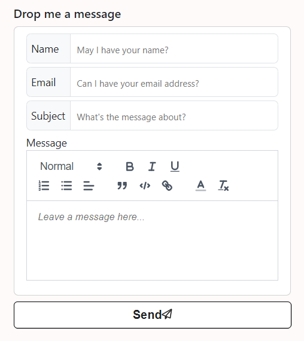

# Cx's portfolio

Welcome to my portfolio repo, which reveals how the website was built! The goal of creating this portfolio website is to give you an in-depth look at my professional journey, highlighting my work experience, skills, and education. It transforms my PDF resume into a convenient web version that you can easily view without needing to download anything.
<br/><br/>
Designed for clarity and engagement, it highlights my expertise in HTML, CSS, and JavaScript, and demonstrates my ability to create responsive and interactive web applications. It also contains a form that uses third-party libraries, including Quill Editor for seamless email templates and EmailJS to send messages to the configured email address.
<br/>

<br/>
Whether you're here to learn more about my background, explore my skills, or get in touch, I hope you find this site both informative and visually appealing.

#### Website URL &#8658; https://h-chinxin.github.io/portfolio/


## Recommended IDE Setup

[VSCode](https://code.visualstudio.com/) + [Volar](https://marketplace.visualstudio.com/items?itemName=Vue.volar) (and disable Vetur).

## Customize configuration

See [Vite Configuration Reference](https://vitejs.dev/config/).

## Project Setup

```sh
npm install
```

### Compile and Hot-Reload for Development

```sh
npm run dev
```

### Compile and Minify for Production

```sh
npm run build
```
