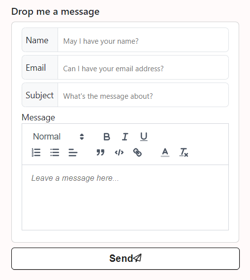

# Hew Chin Xin — Portfolio

Welcome to my portfolio repo, which reveals how the website was built. It highlights my work experience, skills, and projects, and turns my resume into a web version you can browse without downloading a PDF.

The site uses Vue 3 and Vite, with a contact form powered by Quill and EmailJS.



**Live site:** [https://hewchinxin.pages.dev](https://hewchinxin.pages.dev)

Deployed on [Cloudflare Pages](https://pages.cloudflare.com/). See [CLOUDFLARE_DEPLOY.md](./CLOUDFLARE_DEPLOY.md) for deployment and environment variables.

## Development

```sh
npm install
cp .env.example .env.local   # add your EmailJS values
npm run dev
```

```sh
npm run build
npm run preview
```
